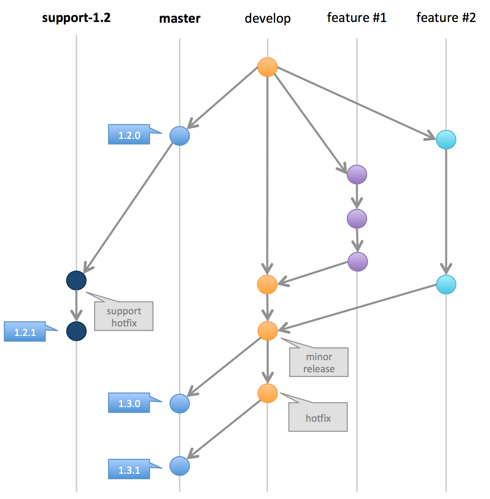

# git-lean

Tools for a lean git workflow. 

## Motivation
 
[Git](https://git-scm.com/) is a very powerful tool but can be very hard to [master](http://think-like-a-git.net/). In our experience none of the more popular git [workflows]( https://www.atlassian.com/git/tutorials/comparing-workflows/) was a perfect fit to our list of requirements:

1. **Don't make me think**: the workflow should be very simple and easy to master by inexperienced git user.
2. **Continous Delivery**: the workflow should focus on continuous delivery. Creating production-ready releases as an everyday job. However deployment to production might not be immediate because of external factors like E2E testing or app store reviews.
3. **Semantic versioning**:  [semantic versioning](http://semver.org/) should be built into git and into the workflow.  

[Github flow](https://guides.github.com/introduction/flow/) is a very agile workflow appropriate for continuous deployment scenarios where integration is partially achieved in production. The very popular [git flow](http://nvie.com/posts/a-successful-git-branching-model/) on the other hand assumes a relatively long running release process and requires frequent merge across severall branches that can get quite complex.
 
So we ended up frequently using custom ad-hoc git flow flavours, that lack a normative reference and a set of tools. This is an attempt to fix that relying on a set of [porcelain](https://git-scm.com/book/tr/v2/Git-Internals-Plumbing-and-Porcelain) git commands.

## Workflow
 
Git lean has two long living branches (as in git flow) *develop* and *master*. 

The following rules apply:

* Anything in the *master* branch is **always** deployable to production.
* You **must** not commit directly to the *master* branch.
* Features **must** be implemented in specific *feature* branches.
* Merges **must** be done with [--no-ff](http://stackoverflow.com/questions/6701292/git-fast-forward-vs-no-fast-forward-merge). 
* Public history **must** not be [rewriten](http://www.mail-archive.com/dri-devel@lists.sourceforge.net/msg39091.html). 
* Master branch **must not** be merged back to *develop*.
* All branches exist both locally and in a git remote repository.

Rebase is a quite powerful feature. However it requires a mildly complex mental model and therefore is not included in the `git-lean` flow.

You should prefer use commit features branches to direct commits to the *develop* branch. However you may commit directly to the *develop* branch for bug fixes and small changes. For long running features you may merge the *develop* branch into the feature brach.

There are no release branches. This workflow assumes that fixing old versions is a rare requirement since code is release often. If that is really necessary you should create a *support* branch from the specific release. 

## How to use

### Install

#### Mac and Linux users

    curl https://raw.githubusercontent.com/tozevv/git-lean/master/git-lean > /usr/local/bin/git-lean
    sudo chmod a+x /usr/local/bin/git-lean

#### Windows users

Download `https://raw.githubusercontent.com/tozevv/git-lean/master/git-lean` and copy it to `C:\Program Files (x86)\Git\libexec\git-core`.

### Create a project

To follow the example please fork the sample project [https://github.com/tozevv/git-lean-playground](https://github.com/tozevv/git-lean-playground) to your github account and clone the project locally to:

	$ git clone https://github.com/youruser/git-lean-playground

Every new checkout requires a init:

	$ cd git-lean-playground
	$ git lean init
	
You have now an empty repository with a *master* and *develop* branch.

### Work on a feature

To start to work on a new feature:

	$ git lean feature start awesome-feature
	
This creates the local and remote feature branch `features/awesome-feature`. Now do some work and add / commit some files. As soon as you're happy with your work an wish to share with the team, simply publish your feature:

	$ git lean feature publish awesome-feature
	
This signals the feature as ready to create a merge request (or [pull request](https://help.github.com/articles/using-pull-requests/) in github parlance).
 
### Reviewing and merging a feature

Peer review is highly encouraged in `git-lean` and is the first step of approving a feature pull request.

To switch to any feature branch for review or additional work:

	$ git lean feature work awesome-feature

If the feature is ok you may merge it with

	$ git lean feature merge awesome-feature

In case of a merge conflict you need to fix it and add your updated files. There is no need to commit them manually, just re-run the previous merge command.

### Creating releases

Creating a release promotes the current *develop* HEAD to *master* and creates a specific release version. 

	$ git lean release 0.2.0
	
The version number is a commit tag. To get the current version:

	$ git checkout master
	$ git lean version
	0.2.0
	
Notice that the version isn't the same if you query develop branch for example:

	$ git checkout develop
	$ git lean version
	0.3.0-snapshot

This reduces the number of tags but provides a usefull way to identify a current working version. 
`git lean version` assumes the next release is minor and version `0.1.0-snapshot` if no releases where created.
	
### Hotfixes
 
A continuous delivery process should strive to create production ready builds. In `git-lean` is assumed that the HEAD of the *master* can be deployed to production at any time. [Feature flagging](https://en.wikipedia.org/wiki/Feature_toggle) should be extensively used to hide for production features completed and tested that cannot be made available to end users.

When faced with a required production hotfix one shall carefully consider one of two options

1. Create a new release based on the latest *develop* code with the fix applied.
2. Create a *support* branch (ex: `support-1.2`) from the *master* branch and apply your fixes. 

`git-lean` assumes the first option is usually preferable reducing the work overload of maintaining multiple versions. You may do the latter manually by branching from the release tag. 

### Cleanup

By default feature branches aren't deleted on merge since it's very common for a feature branch to require a specific fix. In that case we may want to do the fix in the feature branch and by merging it to *develop* again.

To cleanup feature branches that are no longer necessary:

	$ git lean feature delete awesome-feature

This deletes the feature branch on the local and remote repository.

# Aknowledgements

This work is heavily inspired in @pmcxs work in Sky.
Thanks to @cguedes, @pmhsfelix, @sky-celsofernandes for reviewing this document and providind insightful suggestions.

